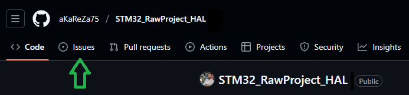

# STM32F103C8 Project Template Using STM32 HAL & CubeMX (Keil Setup)
This repository provides a lightweight and well-structured starting point for STM32F103C8 development, combining the flexibility of STM32CubeMX with the robustness of STM32 HAL libraries. It is tailored for use with Keil uVision, and includes all essential setup files to help developers quickly launch new projects by simply copying the contents into their workspace.
Whether you're building a new embedded application or experimenting with STM32 peripherals, this template helps you get started fast with a reliable foundation.

<table>
  <tr>
  <td valign="top">
  
  > [!TIP]  
  > If you're looking to better understand how to navigate and use my GitHub repositories — including exploring their structure, downloading or cloning projects, submitting issues, and asking questions,  
  > everything you need is clearly explained in this video:  
  > [aKaReZa 95 - Programming, Git - PART B](https://youtu.be/zYiUItVFRqQ)  
  > Make sure to check it out!
  
  </td>
    <td width="360" valign="middle" style="padding: 0;">
      <a href="https://youtu.be/zYiUItVFRqQ">
       
      </a>
    </td>
  </td>
  </tr>

<tr>
  <td valign="top">
  
  > [!IMPORTANT]
  > Begin your embedded systems journey with clarity and purpose. This episode outlines a structured roadmap for mastering microcontrollers, communication protocols, hardware design, and project development.  
  > Learn how to choose your specialization, follow curated playlists, and engage effectively with the community—ideal for learners seeking a scalable, goal-driven path into embedded engineering.  
  > [aKaReZa 124 – Embedded Systems Roadmap](https://youtu.be/3QYfv7A7aMc)  
  > Watch it now to kickstart your journey!
  
  </td>
  <td width="360" valign="middle" style="padding: 0;">
    <a href="https://youtu.be/3QYfv7A7aMc">
      
    </a>
  </td>
</tr>

  
  <tr>
  <td colspan="3">

  > [!CAUTION]
  > It is absolutely critical that you carefully read every single word of this document, line by line, to ensure you don't miss any details. Nothing can be overlooked.
      
  </td>
  </tr>  
</table>

| **Setting**                     | **Default Value**               |
|----------------------------------|----------------------------------|
| Programmer                       | STLink V3 MiniE                  |
| Oscillator Frequency             | 64 MHz                           |
| Serial Port                      | USART1 (Onboard, via USB)        |
| Serial Baud Rate                 | 115200 bps                       |
| Push Button                      | PA10 (Active Low)                |
| Onboard LED                      | PB5 (Active High)                |
| SWO Debug Output                 | Enabled                          |
| `printf` in Debug Environment    | Enabled (via SWO)                |

# 🔗 Resources
  Here you'll find a collection of useful links and videos related to the topic of AVR microcontrollers.  
  
> [!TIP]
> The resources are detailed in the sections below.  
> To access any of them, simply click on the corresponding blue link.

- [STM32 Microcontroller Training](https://github.com/aKaReZa75/STM32)  
  ---  
  This repository offers a **comprehensive guide to STM32 microcontroller programming**, focusing on the STM32F103C8T6. Explore **STM32 architecture, peripheral configuration, timers, interrupts, communication protocols (UART, SPI, I2C), and real-time applications** through practical examples and hands-on projects. Whether you're a beginner or an experienced developer, this resource will help you build a strong foundation and advance your skills in STM32 embedded development.

- [eBoard for STM32F103C8](https://github.com/aKaReZa75/eBoard_STM32F103C8)  
  ---  
  This repository documents the **design, assembly, and testing** of an educational header board built around the STM32F103C8 microcontroller. Designed to be **Arduino UNO-compatible**, this board provides a practical platform for learning and experimenting with STM32 development. It includes schematics, PCB layout to help users understand hardware integration, pin mapping, and peripheral interfacing in a hands-on way.


```plaintext
📁 Hands-on STM32
|
├── [aKaReZa 115 - First Project - PART A]
│     ├─ Hardware — Overview and setup.
│     ├─ CubeMX — Project creation and System Core config.
│     ├─ Clock Tree — Precise configuration.
│     ├─ Project Manager — Navigation and settings.
│     ├─ Packages — Cube and Keil DFP (online/offline).
│     └─ Code Gen — Modes and structure.
│
├── [aKaReZa 118 - First Project - PART B]
│     ├─ Compilation — Building and reviewing output files.
│     ├─ Programming — Flashing via hardware programmer.
│     ├─ Debugging — Register inspection and `printf` usage.
│     ├─ Monitoring — STM Studio for live variable tracking.
│     ├─ Simulation — Proteus-based STM32 testing.
│     └─ Tips — CubeMX refinements and runtime insights.
│
└── [aKaReZa 121 - First Project - PART C]
      ├─ Keil — Logic Analyzer, Simulator, advanced IDE tips.
      ├─ Export — Variable logging and external analysis.
      ├─ Programmer — STM32CubeProgrammer usage.
      ├─ CubeMX — Extra configuration tips.
      ├─ Clock — HSI calibration and HSI vs HSE comparison.
      └─ ST-Link — Interface setup and debugging.
```
<table style="border-collapse: collapse;">
  <tr>
    <td valign="top" style="padding: 0 10px;">
      <h3 style="margin: 0;">
        <a href="https://youtu.be/E2W5Y3cPvDQ">aKaReZa 115 – STM32, First Project - PART A</a>
      </h3>
      <p style="margin: 8px 0 0;">
        Kickstart your STM32 journey by setting up your first bare project. This video covers hardware overview, STM32CubeMX configuration, clock tree setup, Cube Package and Keil DFP installation (online/offline), and code generation modes—perfect for building a solid foundation in STM32 development.
      </p>
    </td>
    <td width="360" valign="top">
      <a href="https://youtu.be/E2W5Y3cPvDQ">
        
      </a>
    </td>
  </tr>

  <tr>
    <td valign="top" style="padding: 0 10px;">
      <h3 style="margin: 0;">
        <a href="https://youtu.be/AEv270zCDno">aKaReZa 118 – STM32, First Project - PART B</a>
      </h3>
      <p style="margin: 8px 0 0;">
        Transition from setup to hands-on testing in your STM32 project. This video walks through compilation, flashing, debugging with <code>printf</code>, real-time variable monitoring via STM Studio, and Proteus simulation. Ideal for developers ready to validate and analyze their STM32 applications with precision.
      </p>
    </td>
    <td width="360" valign="top">
      <a href="https://youtu.be/AEv270zCDno">
        
      </a>
    </td>
  </tr>
  
  <tr>
    <td valign="top" style="padding: 0 10px;">
      <h3 style="margin: 0;">
        <a href="https://youtu.be/E4TNTPMgJMo">aKaReZa 121 – STM32, First Project - PART C</a>
      </h3>
      <p style="margin: 8px 0 0;">
        Dive into STM32 development tools with this hands-on guide. Learn to use Keil’s Logic Analyzer and Simulator, export variables for external analysis, flash and inspect memory with STM32CubeProgrammer, calibrate HSI, compare HSI vs. HSE, and master the ST-Link interface—perfect for refining and debugging your STM32 applications.
      </p>
    </td>
    <td width="360" valign="top">
      <a href="https://youtu.be/E4TNTPMgJMo">
        
      </a>
    </td>
  </tr>
  
</table>

# 💻 How to Use Git and GitHub
To access the repository files and save them on your computer, there are two methods available:
1. **Using Git Bash and Cloning the Repository**
   - This method is more suitable for advanced users and those familiar with command-line tools.
   - By using this method, you can easily receive updates for the repository.

2. **Downloading the Repository as a ZIP file**
   - This method is simpler and suitable for users who are not comfortable with command-line tools.
   - Note that with this method, you will not automatically receive updates for the repository and will need to manually download any new updates.

## Clone using the URL.
First, open **Git Bash** :
-  Open the folder in **File Explorer** where you want the library to be stored.
-  **Right-click** inside the folder and select the option **"Open Git Bash here"** to open **Git Bash** in that directory.


> [!NOTE] 
> If you do not see the "Open Git Bash here" option, it means that Git is not installed on your system.  
> You can download and install Git from [this link](https://git-scm.com/downloads).  
> For a tutorial on how to install and use Git, check out [this video](https://youtu.be/BsykgHpmUt8).
  
-  Once **Git Bash** is open, run the following command to clone the repository:

 ```bash
git clone https://github.com/aKaReZa75/STM32_RawProject_HAL
```
- You can copy the above command by either:
- Clicking on the **Copy** button on the right of the command.
- Or select the command text manually and press **Ctrl + C** to copy.
- To paste the command into your **Git Bash** terminal, use **Shift + Insert**.


- Then, press Enter to start the cloning operation and wait for the success message to appear.


> [!IMPORTANT]
> Please keep in mind that the numbers displayed in the image might vary when you perform the same actions.  
> This is because repositories are continuously being updated and expanded. Nevertheless, the overall process remains unchanged.

> [!NOTE]
> Advantage of Cloning the Repository:  
> - **Receiving Updates:** By cloning the repository, you can easily and automatically receive new updates.  
> - **Version Control:** Using Git allows you to track changes and revert to previous versions.  
> - **Team Collaboration:** If you are working on a project with a team, you can easily sync changes from team members and collaborate more efficiently.  

## Download Zip
If you prefer not to use Git Bash or the command line, you can download the repository directly from GitHub as a ZIP file.  
Follow these steps:  
1. Navigate to the GitHub repository page and Locate the Code button:
   - On the main page of the repository, you will see a green Code button near the top right corner.

2. Download the repository:
   - Click the Code button to open a dropdown menu.
   - Select Download ZIP from the menu.

    

3. Save the ZIP file:
   - Choose a location on your computer to save the ZIP file and click Save.

4. Extract the ZIP file:
   - Navigate to the folder where you saved the ZIP file.
   - Right-click on the ZIP file and select Extract All... (Windows) or use your preferred extraction tool.
   - Choose a destination folder and extract the contents.

5. Access the repository:
   - Once extracted, you can access the repository files in the destination folder.

> [!IMPORTANT]
> - No Updates: Keep in mind that downloading the repository as a ZIP file does not allow you to receive updates.    
>   If the repository is updated, you will need to download it again manually.  
> - Ease of Use: This method is simpler and suitable for users who are not comfortable with Git or command-line tools.

# 📝 How to Ask Questions
If you have any questions or issues, you can raise them through the **"Issues"** section of this repository. Here's how you can do it:  

1. Navigate to the **"Issues"** tab at the top of the repository page.  

  

2. Click on the **"New Issue"** button.  
   
  

3. In the **Title** field, write a short summary of your issue or question.  

4. In the "Description" field, detail your question or issue as thoroughly as possible. You can use text formatting, attach files, and assign the issue to someone if needed. You can also use text formatting (like bullet points or code snippets) for better readability.  

5. Optionally, you can add **labels**, **type**, **projects**, or **milestones** to your issue for better categorization.  

6. Click on the **"Submit new issue"** button to post your question or issue.
   
  

I will review and respond to your issue as soon as possible. Your participation helps improve the repository for everyone!  

> [!TIP]
> - Before creating a new issue, please check the **"Closed"** section to see if your question has already been answered.  
>     
> - Write your question clearly and respectfully to ensure a faster and better response.  
> - While the examples provided above are in English, feel free to ask your questions in **Persian (فارسی)** as well.  
> - There is no difference in how they will be handled!  

> [!NOTE]
> Pages and interfaces may change over time, but the steps to create an issue generally remain the same.

# 🤝 Contributing to the Repository
To contribute to this repository, please follow these steps:
1. **Fork the Repository**  
2. **Clone the Forked Repository**  
3. **Create a New Branch**  
4. **Make Your Changes**  
5. **Commit Your Changes**  
6. **Push Your Changes to Your Forked Repository**  
7. **Submit a Pull Request (PR)**  

> [!NOTE]
> Please ensure your pull request includes a clear description of the changes you’ve made.
> Once submitted, I will review your contribution and provide feedback if necessary.

# 🌟 Support Me
If you found this repository useful:
- Subscribe to my [YouTube Channel](https://www.youtube.com/@aKaReZa75).
- Share this repository with others.
- Give this repository and my other repositories a star.
- Follow my [GitHub account](https://github.com/aKaReZa75).

# 📜 License
This project is licensed under the GPL-3.0 License. This license grants you the freedom to use, modify, and distribute the project as long as you:
- Credit the original authors: Give proper attribution to the original creators.
- Disclose source code: If you distribute a modified version, you must make the source code available under the same GPL license.
- Maintain the same license: When you distribute derivative works, they must be licensed under the GPL-3.0 too.
- Feel free to use it in your projects, but make sure to comply with the terms of this license.
  
# ✉️ Contact Me
Feel free to reach out to me through any of the following platforms:
- 📧 [Email: aKaReZa75@gmail.com](mailto:aKaReZa75@gmail.com)
- 🎥 [YouTube: @aKaReZa75](https://www.youtube.com/@aKaReZa75)
- 💼 [LinkedIn: @akareza75](https://www.linkedin.com/in/akareza75)
